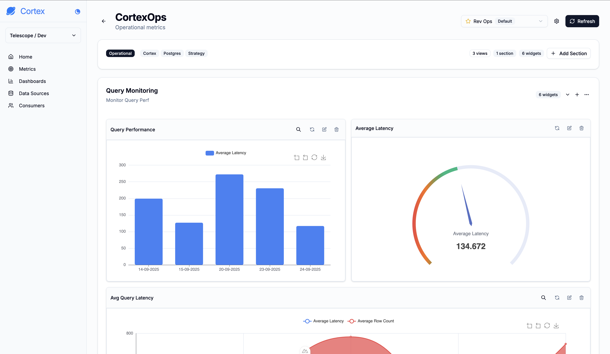

```
 ______     ______     ______     ______   ______     __  __    
/\  ___\   /\  __ \   /\  == \   /\__  _\ /\  ___\   /\_\_\_\   
\ \ \____  \ \ \/\ \  \ \  __<   \/_/\ \/ \ \  __\   \/_/\_\/_  
 \ \_____\  \ \_____\  \ \_\ \_\    \ \_\  \ \_____\   /\_\/\_\ 
  \/_____/   \/_____/   \/_/ /_/     \/_/   \/_____/   \/_/\/_/ 
                                                                
                                                                                                         
```


**The simplest semantic layer for building data driven applications.**

Cortex provides a unified semantic layer that lets you define what matters once and ship analytics faster. Abstract away data complexity, monitor results in realtime, and take proactive actions all through a simple REST API built for modern developers and AI.

- **🎯 Semantic Layer**: Define metrics, dimensions, and measures in JSON with support for output formatting, conditional logic, and parameter systems
- **⚡ Query Engine**: Turn your metrics into optimized queries with built-in caching (Redis, in-memory)
- **🔌 Data Sources**: PostgreSQL, MySQL, BigQuery, SQLite, and Spreadsheets (CSV/Google Sheets). Easy to add custom sources.
- **📊 Dashboards**: Build dashboards using 10+ chart types. Easily extended to support custom visualizations.
- **📁 File Storage**: Upload CSV files with automatic SQLite conversion, hash-based change detection, and cloud storage support (GCS)
- **👥 Multi Tenant**: Hierarchical organization (Workspaces → Environments → Consumers) with context-aware query execution
- **🐍 Python SDK**: Programmatic access via Python SDK
- **🔐 API First**: Comprehensive REST API with OpenAPI documentation

## Quick Start

### Installation

```bash
# Install with API support
pip install telescope-cortex[api]

# Start the server
python -m cortex
```

**Access the API:**
- API Server: `http://localhost:9002`
- Interactive Docs: `http://localhost:9002/docs`

For detailed installation instructions, see the [Getting Started Guide](cortex/docs/content/getting-started.md).

### Create Metric

```python
from cortex.sdk import CortexClient
from cortex.sdk.schemas.requests.metrics import MetricCreateRequest, MetricExecutionRequest
from cortex.core.semantics.measures import SemanticMeasure
from cortex.core.semantics.dimensions import SemanticDimension

# Initialize client
client = CortexClient()

# Create metric with output formatting
metric = client.metrics.create(MetricCreateRequest(
    data_model_id=model_id,
    name="monthly_revenue",
    description="Total revenue aggregated by month",
    table_name="sales",
    measures=[SemanticMeasure(
        name="revenue",
        type="sum",
        query="amount",
        formatting=[{
            "name": "currency",
            "type": "format",
            "mode": "post_query",
            "format_string": "${:,.2f}"
        }]
    )],
    dimensions=[SemanticDimension(
        name="month",
        query="sale_date",
        type="time"
    )]
))

# Execute the metric
result = client.metrics.execute(
    metric.id,
    MetricExecutionRequest(parameters={"start_date": "2024-01-01"})
)
```

```json
{
  "success": true,
  "data": [
    {
      "month": "2024-01-01",
      "revenue": "$12,500.50"
    },
    {
      "month": "2024-02-01",
      "revenue": "$14,230.75"
    }
  ],
  "metadata": {
    "metric_id": "8f3e5b12-9c1a-4d3b-8e2f-7a6c5b4d3e2f",
    "duration": 25.4,
    "row_count": 2,
    "query": "SELECT sale_date, SUM(amount) FROM sales WHERE sale_date >= '2024-01-01' GROUP BY 1",
    "parameters": {
      "start_date": "2024-01-01"
    }
  }
}
```

See the [Python SDK Documentation](cortex/sdk/README.md) for complete SDK reference, or the [API Reference](cortex/api/README.md) for API usage.

## Studio

Cortex includes a modern GUI for managing workspaces, data sources, metrics, and dashboards.

```bash
cd frontend/cortex
yarn install
yarn run dev
```

## Documentation

### 📚 Core

| Concepts | Description |
|--------------|-------------|
| **[Getting Started](cortex/docs/content/getting-started.md)** | Installation, configuration, and quick start tutorial |
| **[Architecture](cortex/docs/content/architecture.md)** | System architecture |
| **[Multi Tenancy](cortex/docs/content/multi-tenancy.md)** | Workspaces, environments, and consumer management |
| **[Development](cortex/docs/content/development.md)** | Contributing guidelines and development setup |

### 🔧 Modules

| Module | Description |
|--------|-------------|
| **[Core Modules](cortex/core/README.md)** | Overview of all core components |
| **[Semantic Layer](cortex/core/semantics/README.md)** | Metric definitions, measures, dimensions, and formatting |
| **[Query Engine](cortex/core/query/README.md)** | SQL generation, caching, and preaggregations |
| **[Data Sources](cortex/core/data/sources/README.md)** | Database connectors and schema introspection |
| **[Dashboards](cortex/core/dashboards/README.md)** | Visualization types and widget configuration |
| **[Python SDK](cortex/sdk/README.md)** | Python SDK for programmatic access to Cortex |
| **[API Reference](cortex/api/README.md)** | REST API endpoints and usage examples |

### 📖 Guides

- **[Database Migrations](cortex/migrations/MIGRATION_GUIDE.md)** - Alembic migration management
- **[Spreadsheet Data Sources](cortex/core/connectors/api/sheets/README.md)** - CSV and Google Sheets configuration

## Contributing

Contributions are welcome! Please see the [Development Guide](cortex/docs/content/development.md)

## License

This project is licensed under the MIT License - see the [LICENSE](LICENSE) file for details.

## Attribution

Cortex was inspired by [Cube's Semantic Layer](https://cube.dev) and [Metabase](https://metabase.com). We built upon their work to create a lightweight analytics platform.

## Support

For questions and support:
- **Issues**: [GitHub Issues](https://github.com/TelescopeAI/cortex/issues)
- **Email**: [help@jointelescope.com](mailto:help@jointelescope.com)
- **Documentation**: [docs.jointelescope.com](https://docs.jointelescope.com)
- **Pull Requests**: [Contribute](https://github.com/TelescopeAI/cortex/compare)

[](https://github.com/TelescopeAI/cortex/stargazers)