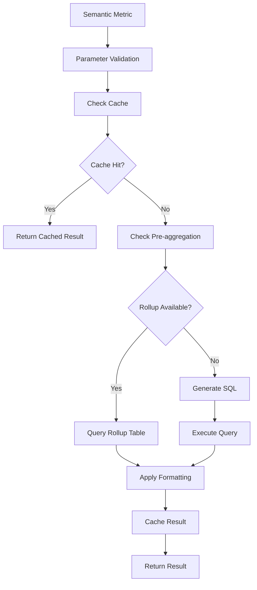

# Query Engine

The Cortex Query Engine translates semantic metric definitions into optimized SQL queries and executes them across heterogeneous data sources. It features multi-layer caching, pre-aggregations, and comprehensive query monitoring.


*Query execution flow from semantic definition to results*

## Overview

The query engine is responsible for:

- Translating semantic metrics into database-specific SQL
- Managing query execution across multiple data sources
- Caching results for improved performance
- Pre-computing aggregations for frequently accessed data
- Tracking query history and performance metrics
- Applying output formatting and transformations

## Query Translation & Generation

The query engine uses a multi-step process to generate optimized SQL:

### 1. Semantic Parsing

The engine parses the `SemanticMetric` definition to understand:
- Measures to compute
- Dimensions to group by
- Filters to apply
- Parameters to substitute

### 2. SQL Generation

Based on the semantic definition and target database type, the engine generates optimized SQL:

```python
from cortex.core.query.executor import QueryExecutor
from cortex.core.semantics.metrics.metric import SemanticMetric

executor = QueryExecutor()
result = executor.execute_metric(
    metric=your_metric,
    data_model=your_model,
    parameters={"start_date": "2024-01-01"}
)
```

### 3. Database-Specific Optimization

The engine adapts queries for different database dialects:
- **PostgreSQL**: Advanced window functions, CTEs
- **MySQL**: Optimized GROUP BY clauses
- **BigQuery**: Partitioning and clustering hints
- **SQLite**: In-memory optimizations

### 4. Parameter Substitution

Runtime parameters are safely substituted into the query:

```python
# Metric with parameter
filter_query = "date >= {{start_date}}"

# Executed with parameter
result = executor.execute_metric(
    metric=metric,
    parameters={"start_date": "2024-01-01"}
)
```

## Caching System

Cortex implements a multi-layer caching strategy for optimal performance.

### Cache Backends

#### Redis Cache (Recommended for Production)

```bash
export CORTEX_CACHE_ENABLED=true
export CORTEX_CACHE_BACKEND=redis
export CORTEX_CACHE_REDIS_URL=redis://localhost:6379
```

**Features:**
- Distributed caching across multiple servers
- Persistent cache across restarts
- TTL-based expiration
- Cache invalidation support

#### In-Memory Cache (Development)

```bash
export CORTEX_CACHE_ENABLED=true
export CORTEX_CACHE_BACKEND=memory
```

**Features:**
- Fast, zero-setup caching
- Ideal for development and testing
- Automatic memory management
- Process-local storage

### Cache Configuration

Configure cache behavior per query:

```python
result = executor.execute_metric(
    metric=metric,
    cache={
        "enabled": True,
        "ttl": 3600  # Cache for 1 hour
    }
)
```

### Cache Keys

Cache keys are generated based on:
- Metric definition hash
- Parameter values
- Data model version
- Consumer context (for multi-tenant isolation)

### Cache Invalidation

Caches are automatically invalidated when:
- Metric definition changes
- Data model is updated
- TTL expires
- Manual invalidation is triggered

## Pre-aggregations & Rollup Tables

Pre-aggregations allow you to pre-compute and store aggregated data for frequently accessed metrics.

### Creating Pre-aggregations

```json
{
  "name": "daily_revenue_rollup",
  "metric_id": "monthly_revenue",
  "refresh_schedule": "0 2 * * *",  # Daily at 2 AM
  "partitioning": {
    "type": "time",
    "column": "date",
    "granularity": "day"
  }
}
```

### Query Bindings

The query engine automatically routes queries to pre-aggregation tables when available:

1. **Query Analysis**: Check if pre-aggregation exists for the metric
2. **Compatibility Check**: Verify query can be satisfied by rollup
3. **Query Rewrite**: Rewrite query to use pre-aggregation table
4. **Fallback**: Use original query if pre-aggregation is unavailable

### Benefits

- **Faster Queries**: Pre-computed aggregations return results instantly
- **Reduced Load**: Minimize load on source databases
- **Consistent Performance**: Predictable query times
- **Cost Savings**: Reduce compute costs on cloud warehouses

## Query History & Monitoring

All query executions are automatically logged for monitoring and analysis.

### Logged Information

- Query SQL and parameters
- Execution time
- Rows returned
- Cache hit/miss
- Data source used
- Consumer context
- Error details (if failed)

### Query History API

```python
from cortex.core.query.history import QueryHistoryService

service = QueryHistoryService()

# Get recent queries
history = service.get_history(
    limit=50,
    environment_id="env-123"
)

# Find slow queries
slow_queries = service.get_slow_queries(
    threshold_ms=5000,
    limit=20
)

# Cache statistics
stats = service.get_cache_stats(
    environment_id="env-123",
    date_range=("2024-01-01", "2024-12-31")
)
```

### Performance Analytics

Track and analyze query performance:

- **Average Execution Time**: Monitor query performance trends
- **Cache Hit Rate**: Measure caching effectiveness
- **Slow Query Identification**: Find queries needing optimization
- **Data Source Load**: Monitor load distribution across sources


*Cache performance metrics and optimization visualization*

## Performance Optimization

### Query Optimization Techniques

1. **Indexing**: Ensure proper indexes on filtered/grouped columns
2. **Partitioning**: Partition large tables by date or other dimensions
3. **Pre-aggregations**: Create rollups for frequently accessed metrics
4. **Caching**: Enable caching with appropriate TTLs
5. **Query Simplification**: Avoid unnecessary joins and subqueries

### Monitoring Performance

```python
# Enable query profiling
result = executor.execute_metric(
    metric=metric,
    profile=True
)

# Access profiling data
print(f"Execution time: {result.execution_time_ms}ms")
print(f"Rows returned: {result.row_count}")
print(f"Cache hit: {result.cache_hit}")
```

### Best Practices

1. **Use Pre-aggregations**: For metrics queried frequently
2. **Set Appropriate TTLs**: Balance freshness vs. performance
3. **Monitor Slow Queries**: Regularly review query history
4. **Optimize Filters**: Push filters down to the database
5. **Batch Similar Queries**: Reduce redundant executions

## Query Execution Flow



## Output Formatting

The query engine supports two formatting modes:

### In-Query Formatting

Applied during SQL generation:

```python
{
    "name": "date_truncate",
    "type": "cast",
    "mode": "in_query",
    "target_type": "date"
}
```

### Post-Query Formatting

Applied to results after execution:

```python
{
    "name": "currency_format",
    "type": "format",
    "mode": "post_query",
    "format_string": "${:,.2f}"
}
```

## Error Handling

The query engine provides comprehensive error handling:

```python
from cortex.core.exceptions import QueryExecutionError

try:
    result = executor.execute_metric(metric=metric)
except QueryExecutionError as e:
    print(f"Query failed: {e.message}")
    print(f"SQL: {e.sql}")
    print(f"Error details: {e.details}")
```

**Common error types:**
- `QueryExecutionError` - Query execution failed
- `ParameterValidationError` - Invalid parameters provided
- `DataSourceConnectionError` - Cannot connect to data source
- `CacheError` - Cache operation failed

## Advanced Features

### Multi-Source Queries (Planned)

Future support for queries spanning multiple data sources:

```python
# Join data from PostgreSQL and BigQuery
result = executor.execute_multi_source_metric(
    metric=metric,
    sources=["postgres_db", "bigquery_warehouse"]
)
```

### Query Streaming

For large result sets, use streaming to avoid memory issues:

```python
for batch in executor.execute_metric_stream(metric=metric, batch_size=1000):
    process_batch(batch)
```

### Parallel Execution

Execute multiple metrics in parallel:

```python
results = executor.execute_metrics_parallel(
    metrics=[metric1, metric2, metric3]
)
```

## Configuration

### Environment Variables

```bash
# Cache configuration
CORTEX_CACHE_ENABLED=true
CORTEX_CACHE_BACKEND=redis
CORTEX_CACHE_REDIS_URL=redis://localhost:6379

# Pre-aggregations
CORTEX_PREAGGREGATIONS_ENABLED=true

# Query timeouts
CORTEX_QUERY_TIMEOUT_SECONDS=300
```

### Query Executor Options

```python
executor = QueryExecutor(
    cache_enabled=True,
    cache_backend="redis",
    default_timeout=60,
    max_retries=3
)
```

## Related Documentation

- [Semantic Layer](../semantics/README.md) - Defining metrics and dimensions
- [Data Sources](../data/sources/README.md) - Connecting to databases
- [Pre-aggregations API](../../api/README.md#pre-aggregations) - Managing rollup tables
- [Caching Guide](../../docs/content/getting-started.md#caching) - Cache configuration
